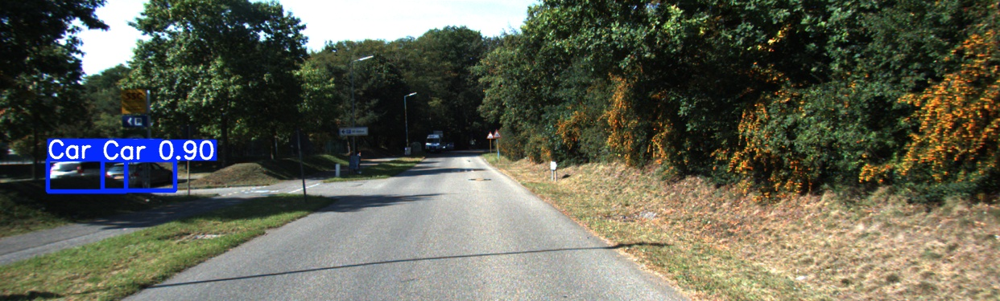

# 2D Object Detection for Autonomous Driving with YOLO

This project trains, evaluates, and visualizes YOLO-based 2D object detectors for autonomous-driving scenes from the KITTI dataset.

## What it includes

- Training pipeline for YOLO models on KITTI-format data
- Inference pipeline that produces visualizations and KITTI-format predictions
- Local KITTI-style evaluator for Car, Pedestrian, and Cyclist
- Analysis scripts for training curves and class-level performance

## Repository structure

- train_yolo_kitti.py: training and validation
- inference_yolo_kitti.py: inference, visualization, and prediction export
- evaluate_kitti.py: local KITTI-style evaluation
- analyze_results.py: training and evaluation analysis
- prepare_kitti_dataset.py: dataset preparation utilities
- kitti.yaml: dataset configuration

Local datasets, downloaded model weights, environments, and generated runs are excluded from version control.

## Setup

Requires Python 3.11 or later and uv.

~~~bash
git clone https://github.com/dskcoder/yolo-kitti-object-detection.git
cd yolo-kitti-object-detection
uv sync
~~~

Place the official data_object_image_2.zip and data_object_label_2.zip archives in data/kitti_official/raw/, then run:

~~~bash
uv run python prepare_kitti_dataset.py --val-ratio 0.2 --seed 42
~~~

The script extracts the archives, converts KITTI labels to YOLO format, and creates deterministic train and validation splits under data/kitti/. Update kitti.yaml only if you use a different output path.

## Reproducible split

The exact train and validation image IDs used for the local experiments are provided in splits/train.txt and splits/val.txt. The split configuration is recorded in splits/split_info.txt. No KITTI images, labels, or archives are included in this repository.

## Usage

Train the default YOLO11m configuration:

~~~bash
uv run python train_yolo_kitti.py --model yolo11m.pt --epochs 100 --batch 16 --imgsz 640
~~~

Run inference and export predictions:

~~~bash
uv run python inference_yolo_kitti.py \
  --model runs/detect/<experiment>/weights/best.pt \
  --source data/kitti/images/val \
  --save-txt \
  --visualize
~~~

Evaluate exported predictions:

~~~bash
uv run python evaluate_kitti.py \
  --predictions runs/inference_output/kitti_format \
  --ground-truth data/kitti/labels/val \
  --output runs/evaluation_results
~~~

## Local evaluation results

These values were measured with this repository's local KITTI-style evaluator. They are not official KITTI leaderboard results.

Moderate-difficulty mean AP: YOLO11m 94.66%, YOLO26s 91.87%, and YOLO26n 85.24%.

YOLO11m class-level AP: Car 99.11%, Pedestrian 89.70%, and Cyclist 95.18%.

The evaluator uses IoU thresholds of 0.7 for cars and 0.5 for pedestrians and cyclists. These figures are intended for comparison within this project, not for an official KITTI benchmark submission.

## Example detection

## References

Ultralytics documentation: https://docs.ultralytics.com/

KITTI Vision Benchmark Suite: https://www.cvlibs.net/datasets/kitti/

KITTI dataset paper: https://arxiv.org/abs/1204.1652

## Dataset attribution

Geiger, A., Lenz, P., and Urtasun, R. Are we ready for Autonomous Driving? The KITTI Vision Benchmark Suite. CVPR, 2012.
